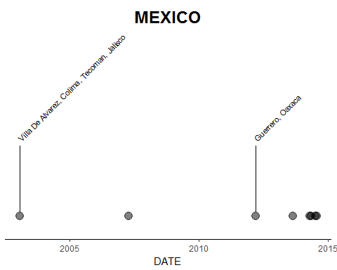

This package contains functions to clean and visualise earthquake data.

## Load Library

```r
library(readr)
library(dplyr)
library(stringr)
library(lubridate)
library(ggplot2)
library(leaflet)
library(MasteringSoftwareDevelopmentCapstone)
```

## Import Dataset
The raw dataset is obtained from National Geophysical Data Center / World Data Service (NGDC/WDS): Significant Earthquake Database. National Geophysical Data Center, NOAA. Click here [doi:10.7289/V5TD9V7K](http://dx.doi.org/10.7289/V5TD9V7K)

For convenience, the data has been preloaded into `./inst/extdata/dataset.txt`.


```r
raw_data <- system.file("extdata", "dataset.txt", 
                        package = "MasteringSoftwareDevelopmentCapstone")
```

## Clean Data
This create a cleaned data for earthquakes since 01 Jan 1900, excluding data points with missing magnitude or intensity.

```r
cleaned_data <- eq_clean_data(raw_data)
cleaned_data <- eq_location_clean(cleaned_data)
head(cleaned_data, 5)
#> # A tibble: 5 x 8
#>   DATE       LATITUDE LONGITUDE COUNTRY   LOCATION    MAGNI~ INTEN~ DEATH~
#>   <date>        <dbl>     <dbl> <chr>     <chr>        <dbl>  <dbl>  <dbl>
#> 1 1900-07-12     40.3      43.1 TURKEY    " Kars,Kar~   5.90   8.00    0  
#> 2 1900-10-09     57.1    -153   USA       Alaska:  K~   8.30   8.00    0  
#> 3 1900-10-29     11.0    - 66.0 VENEZUELA " Macuto"     8.40  10.0    25.0
#> 4 1900-12-25     43.0     146   RUSSIA    " Kuril Is~   7.90   9.00    0  
#> 5 1901-02-15     26.0     100   CHINA     " Yunnan P~   6.00   8.00    0
```

## Create Timeline Plot

```r
ggplot(data = cleaned_data, 
       aes(x = DATE, country = COUNTRY, label = LOCATION, magnitude = MAGNITUDE)) +
  geom_timeline(ctry = "MEXICO", xmin = dmy("01/01/2000"), xmax = dmy("01/01/2018")) +
  geom_timeline_label(n_max = 2, ctry = "MEXICO", 
                      xmin = dmy("01/01/2000"), xmax = dmy("01/01/2018")) +
  theme_classic()
```

<!-- -->

## Create Map Plot

```r
cleaned_data %>% 
  filter(COUNTRY == "MEXICO" & year(DATE) >= 2000) %>% 
  mutate(popup_text = eq_create_label(.)) %>% 
  eq_map(annot_col = "popup_text")
```

preserve18af4693b55028da
